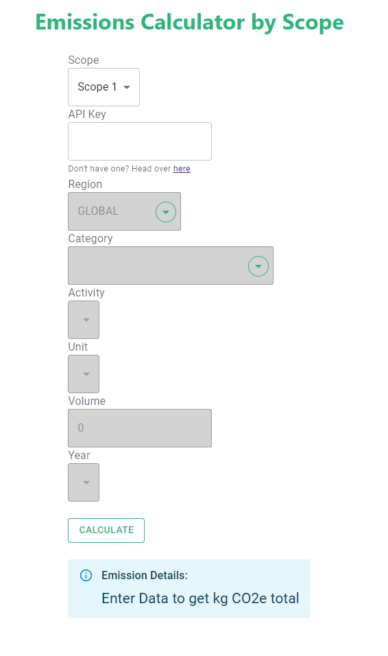
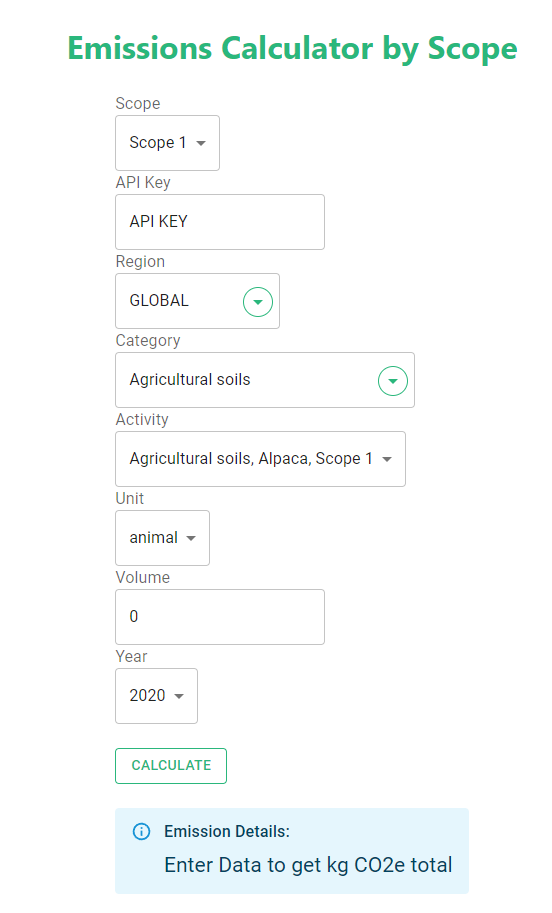

## Auto calculator for scope 1 and 2 emissions using DitchCarbon API

### Prerequisites

-   Node JS

### Getting Started

-   Pull/download code
-   Run:
    `npm install`
-   Run:
    `npm run dev`

### What you should see

-   Head to localhost:3000 and you should see:

- Firstly, select the scope for the emissions you want to calculate. You can select either scope 1 or scope 2. 

- Next, enter your API key. If you don't already have one, you can get one from [DitchCarbon](https://ditchcarbon.com/get-started/).

- After you enter it, you should see this:

- You are now set up!